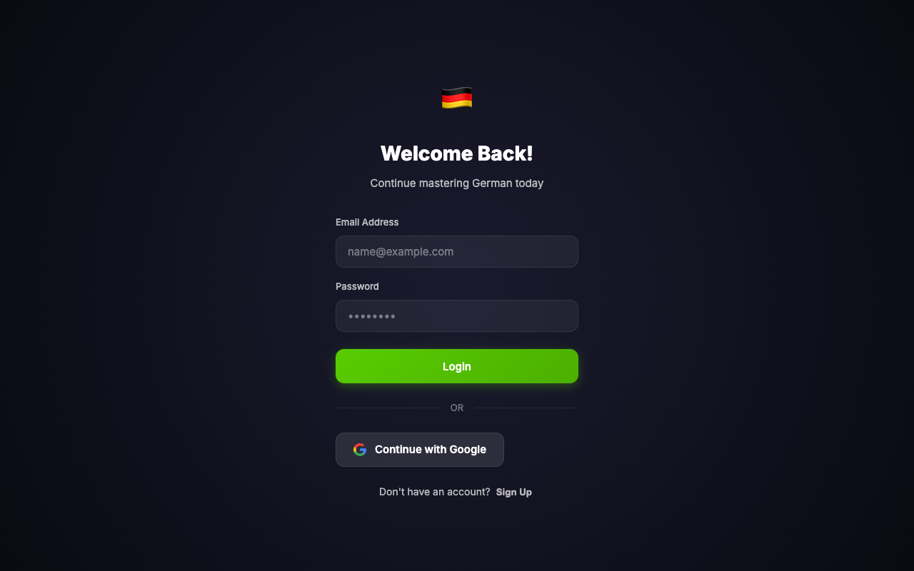
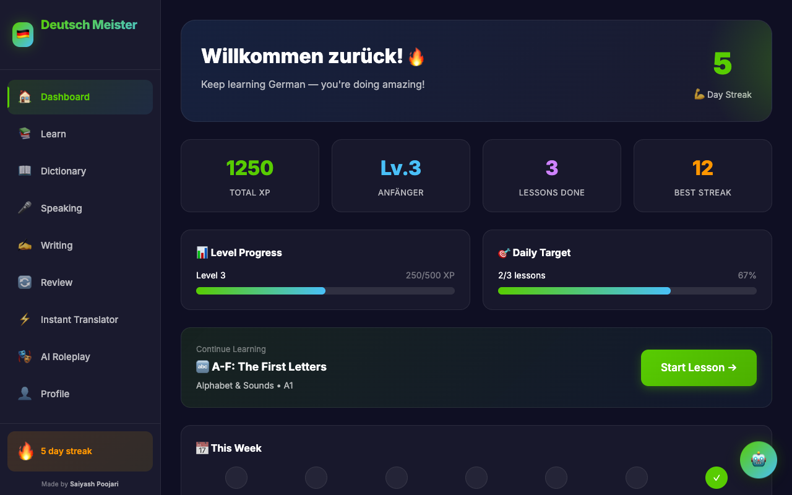
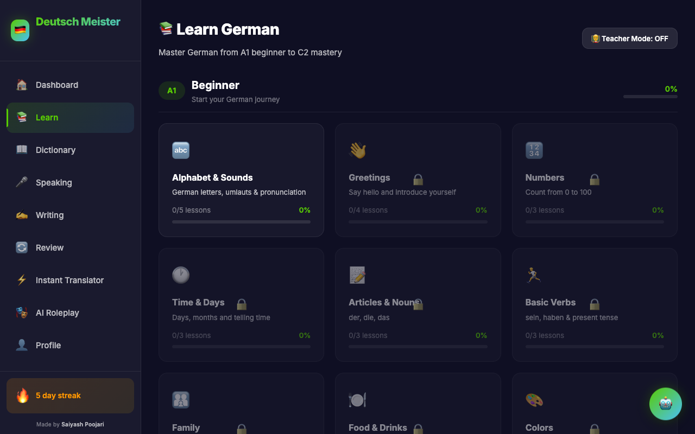
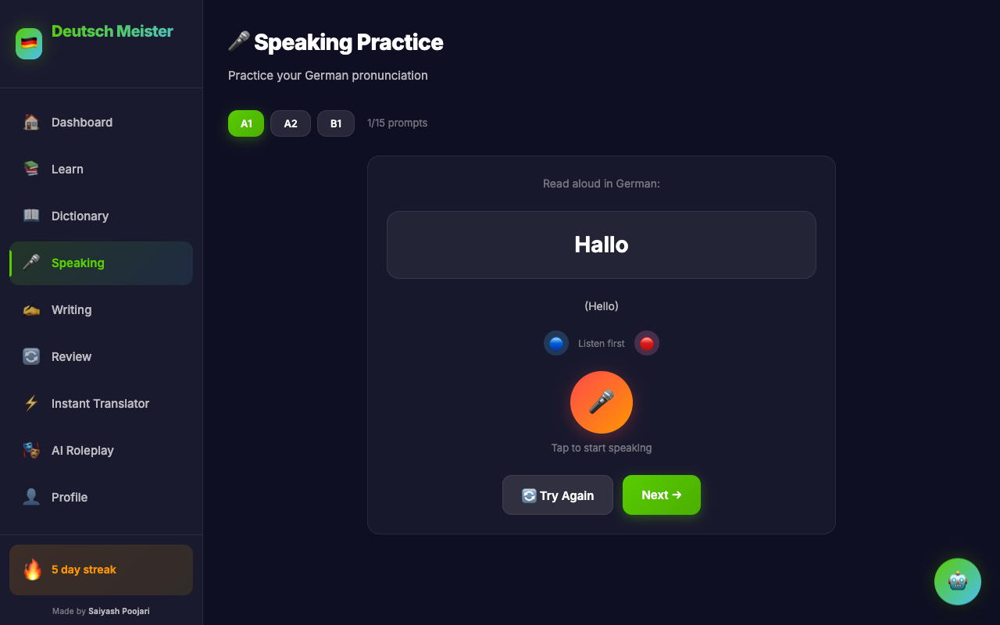
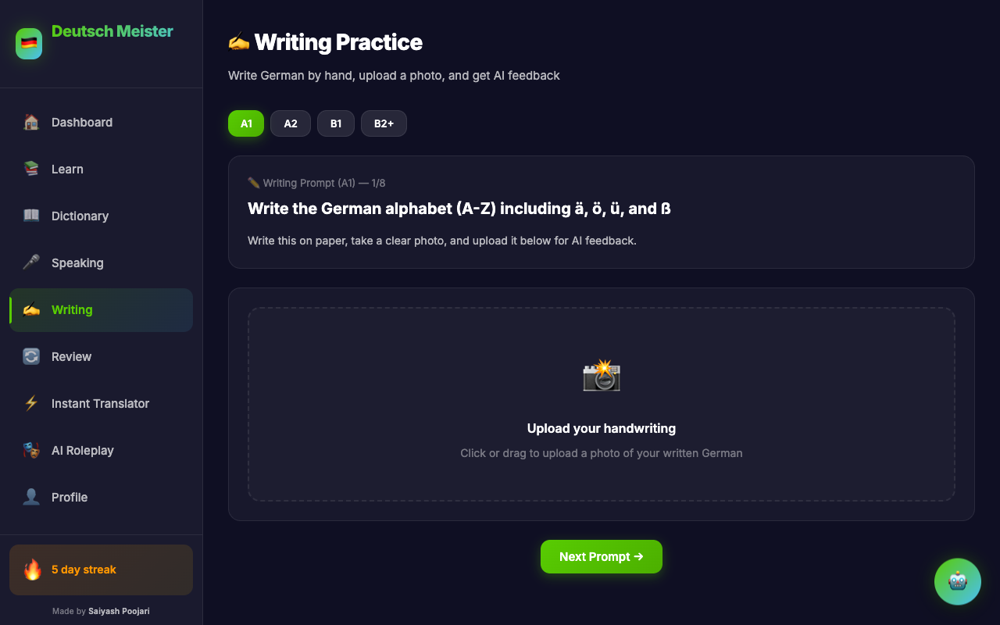
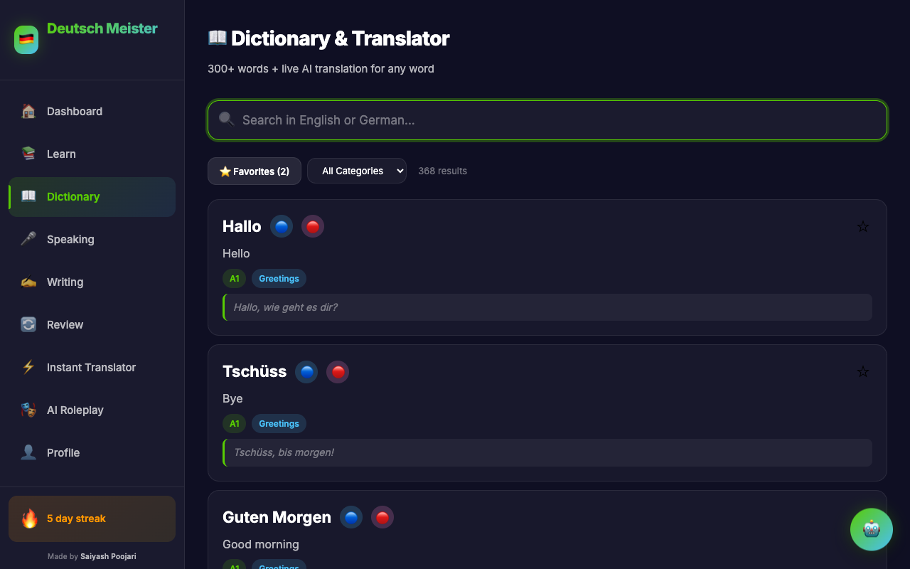
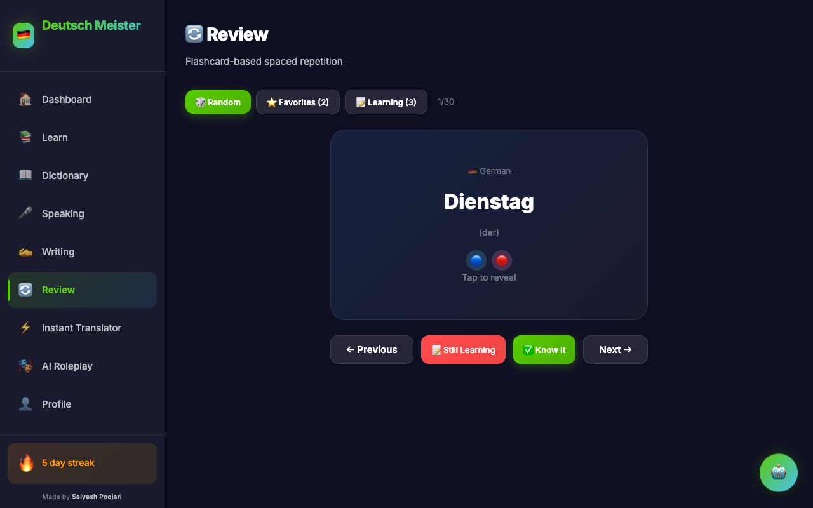
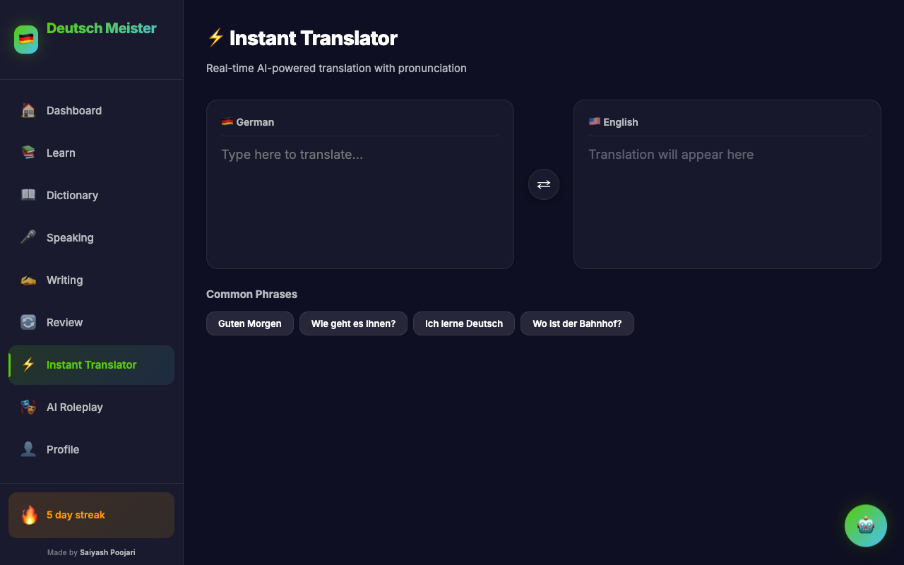
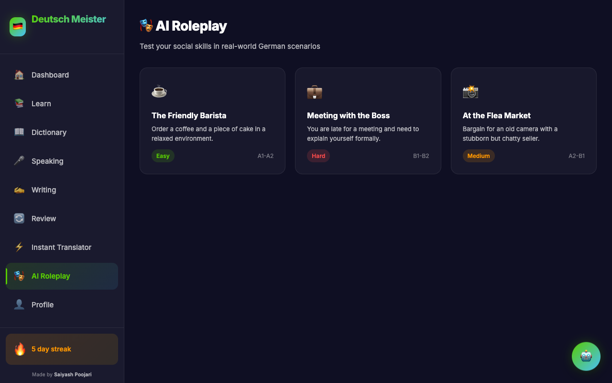
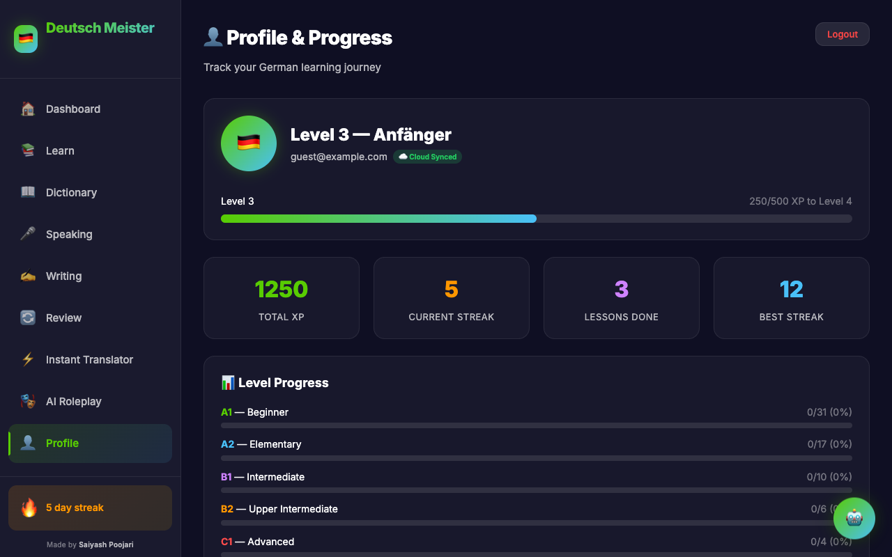

# Deutsch Meister (German Practice)

A modern, gamified, offline-first German language learning web application designed to help users master vocabulary, pronunciation, writing, and conversational skills. **Deutsch Meister** integrates real-time database synchronization, speech recognition, and advanced generative AI to provide feedback on both spoken pronunciation and handwritten exercises.

---

## 📸 Application Screenshots

Here is a visual tour of **Deutsch Meister**:

| 👤 Authentication Screen | 🏠 User Dashboard |
|:---:|:---:|
|  |  |

| 📚 Learning Curriculum (A1 - C2) | 🎤 Pronunciation Practice (Speaking) |
|:---:|:---:|
|  |  |

| ✍️ Multimodal Writing Analysis | 📖 Searchable Dictionary |
|:---:|:---:|
|  |  |

| 🔄 Vocabulary Review | ⚡ Instant Translator |
|:---:|:---:|
|  |  |

| 🎭 Interactive AI Roleplay | 👤 Profile & Settings |
|:---:|:---:|
|  |  |

---

## 🛠️ Tech Stack & Architecture

*   **Frontend Library:** React 19 (Hooks, Context, Custom hooks for state management)
*   **Build Tool & Bundler:** Vite 8 (Hot Module Replacement, tree-shaking, optimized asset compilation)
*   **Routing:** React Router v7 (Single-Page Application routing with protected routes)
*   **Database & Synchronization:** Cloud Firestore (NoSQL, real-time sync with offline state reconciliation)
*   **Authentication:** Firebase Auth (Email/Password credentials and Google OAuth)
*   **AI Integration:** Google Gemini API (`gemini-1.5-flash` / `gemini-pro` for conversational roleplay, translation assistance, and computer vision writing analysis)
*   **Speech Processing:** Web Speech API (`SpeechRecognition` / `SpeechSynthesis` engines)
*   **Styling:** Custom Vanilla CSS (Fluid layout grids, responsive design system, custom keyframe micro-animations, glassmorphism UI)

---

## 🚀 Key Architectural Features & Technical Highlights

### 1. Offline-First Synchronization Engine (`useProgress` Hook)
*   **Hybrid State Hydration:** On application mount, progress states (XP, streaks, lessons completed, dictionaries) are loaded instantaneously from `localStorage` to ensure zero-latency startup.
*   **Bi-directional Firebase Sync:** When a user is authenticated, the custom `useProgress` hook fetches cloud documents, merges states (giving precedence to database configurations), and sets up a real-time Firestore synchronization listener (`onSnapshot`).
*   **Debounced Cloud Persistence:** To prevent API rate-limiting and minimize database write costs, Firestore updates are debounced by `1000ms`, compiling rapid user progress (e.g., completing multi-step exercises) into a single batch write.

### 2. Speech Analysis & Pronunciation Auditing (`useSpeech` Hook)
*   **Real-time Recognition:** Captures spoken input directly using the Web Speech API configured to the German locale (`de-DE`).
*   **Pronunciation Benchmarking:** Computes accuracy scores by comparing user speech with target German sentences. The algorithm normalizes strings (lowercase conversion, regex punctuation stripping) and maps words.
*   **Levenshtein Distance Algorithm:** Employs a matrix-based Levenshtein distance calculation to provide fuzzy matching on misspelled or mispronounced words, returning a dynamic feedback score (0-100%).
*   **Text-to-Speech (TTS):** Integrates customizable speech synthesizers supporting gender-specific voices (`male`/`female`) to provide correct pronunciation models.

### 3. Generative AI Conversation Partner & Scenario Auditing (AI Roleplay)
*   **Scenario-Based Agent Tuning:** Feeds scenario parameters (e.g., booking a hotel room, ordering food) as system instructions to the Gemini API. The AI agent acts as a native German partner, offering contextual responses.
*   **Social Etiquette Correction:** The system prompt instructs the AI to detect social register issues (e.g., inappropriate use of formal *Sie* vs. informal *Du*) and output subtle etiquette corrections in English alongside its German dialogue.
*   **Post-Session Audit:** Upon ending a roleplay session, a final prompt conducts a structural review of the entire transcript. The AI parses the conversation history and generates a report card scoring Grammar, Vocabulary, and Etiquette.

### 4. Computer Vision Handwriting Analysis (Writing Module)
*   **Multimodal Image Processing:** Users write German prompts physically on paper, upload a photo, and the app reads the file, converts it to base64, and forwards it to Gemini.
*   **Visual Ingestion & Grading:** The multimodal Gemini model analyzes the hand-drawn characters, evaluates spelling (explicitly verifying Umlauts `ä, ö, ü` and Eszett `ß`), identifies grammatical anomalies, and grades legibility.
*   **Pedagogical Feedback:** Generates targeted correction advice and scores the exercise out of 100.

### 5. Gamification Mechanics & Utilities
*   **XP Engine (`xp.js`):** Increments experience points (XP) dynamically (10 XP per exercise, 50 XP per lesson bonus). Tracks levels based on an exponential progression (500 XP per level) and assigns titles from *Anfänger* to *Großmeister*.
*   **Streak Verification (`streak.js`):** Checks activity logs during application launch. If the user’s last active date is today or yesterday, the streak is maintained. If it exceeds 24 hours, the streak resets to 0. Unlocks visual badges (🔥, ⚡, ✨) as streaks hit milestones.
*   **Structure-Guided Lessons (`curriculum.js`):** Offers modular course layouts tracking progressive concepts across European Framework levels (A1, A2, B1, B2+).

---

## 📂 Codebase Directory Structure

```yaml
src/
├── components/          # Reusable UI components
│   ├── ChatBot.jsx      # Generic floating assistant panel
│   ├── Layout.jsx       # Standard shell containing responsive sidebars
│   ├── Sidebar.jsx      # Sticky navigation system
│   └── PronunciationBtn # Interactive Audio Synthesis launcher
├── data/                # Static data layers
│   ├── curriculum.js    # Lesson hierarchy and structure
│   ├── dictionary.js    # Preloaded offline vocabulary database
│   ├── exercises.js     # Questions database mapped to modules
│   └── roleplays.js     # Structured AI prompts & avatars for scenarios
├── hooks/               # Custom React hooks
│   ├── useAI.js         # API interface for Gemini models & token management
│   ├── useAuth.js       # Firebase authentication state listener
│   ├── useProgress.js   # Offline-first state persistence logic
│   └── useSpeech.js     # Microphone capture and string comparison logic
├── pages/               # Routed page components
│   ├── Dashboard.jsx    # User statistics, levels, and streak panel
│   ├── Dictionary.jsx   # Searchable dictionary with favorites bank
│   ├── Learn.jsx        # Learning curriculum and module select
│   ├── Lesson.jsx       # Dynamic Q&A practice session component
│   ├── Speaking.jsx     # Voice pronunciation practice module
│   ├── Writing.jsx      # Handwriting capture & image analysis screen
│   └── ...              # Review, Translator, Roleplay, Profile, Auth
├── utils/               # Math, string, and date algorithms
│   ├── speech.js        # Web Speech voice synthesizers
│   ├── streak.js        # Calendar streak calculation logic
│   └── xp.js            # Level scaling computations
├── firebase.js          # Client configurations for Firebase SDK
├── index.css            # Base stylesheet (themes, glassmorphism UI variables)
└── main.jsx             # React Virtual DOM entrypoint
```

---

## 🔧 Installation & Local Setup

To run this application locally, ensure you have **Node.js** installed, then follow these steps:

### 1. Clone the repository
```bash
git clone https://github.com/saiyash07/deutsch-meister.git
cd deutsch-meister
```

### 2. Install dependencies
```bash
npm install
```

### 3. Setup Firebase
The project relies on Firebase. In `src/firebase.js`, verify or configure the application keys:
```javascript
const firebaseConfig = {
  apiKey: "YOUR_FIREBASE_API_KEY",
  authDomain: "YOUR_PROJECT_ID.firebaseapp.com",
  projectId: "YOUR_PROJECT_ID",
  storageBucket: "YOUR_PROJECT_ID.firebasestorage.app",
  messagingSenderId: "YOUR_SENDER_ID",
  appId: "YOUR_APP_ID"
};
```
Enable **Email/Password** and **Google** sign-in methods inside the Firebase Console, and provision a **Firestore Database**.

### 4. Run the development server
```bash
npm run dev
```
Open [http://localhost:5173](http://localhost:5173) in your browser.

### 5. Build for production
To build optimized, minified static files:
```bash
npm run build
```

---

## 📄 License

This project is licensed under the MIT License. See the [LICENSE](file:///Users/saiyashpoojari/Desktop/German%20Practice/LICENSE) file for details.
